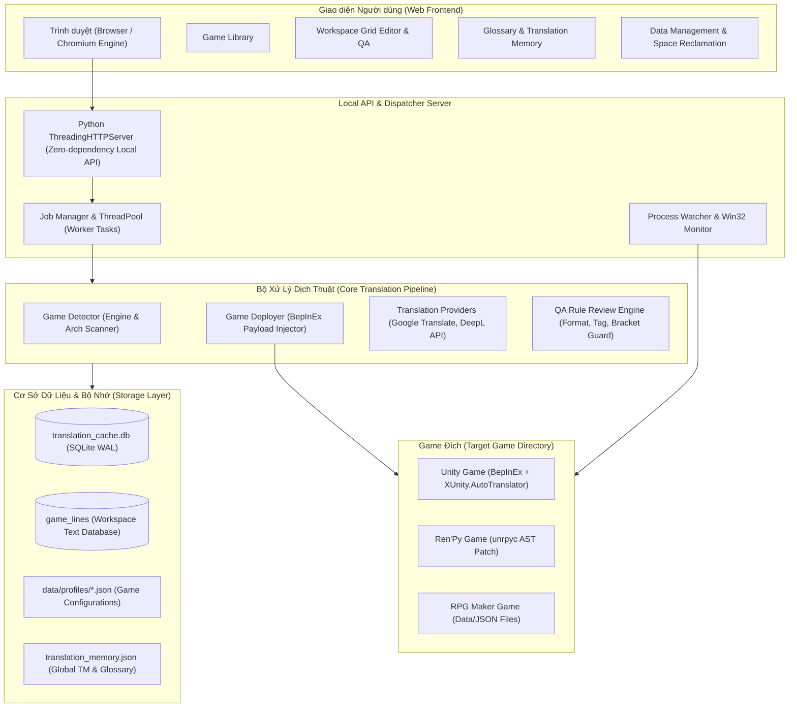
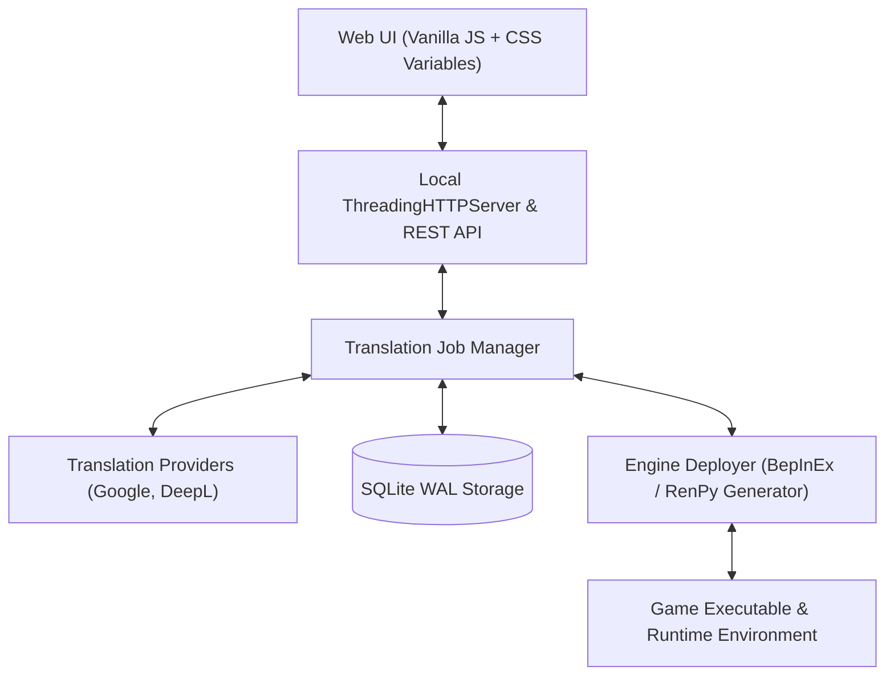

# Auto Translator Manager (ATM V2)

<div align="center">

  <h1>🌐 Auto Translator Manager</h1>
  <p><strong>The modern, high-performance automated game translation framework & workspace for Visual Novels, RPGs, and Unity/Ren'Py adventures.</strong></p>

  <p>
    <a href="https://github.com/danhdz07082005/AutoTranslatorManager/releases">
      
    </a>
    <a href="https://www.python.org/downloads/">
      
    </a>
    <a href="#">
      
    </a>
    <a href="#">
      
    </a>
    <a href="#">
      
    </a>
  </p>

  <p>
    <b><a href="#-tiếng-việt">🇻🇳 Tiếng Việt</a></b> &nbsp;•&nbsp; 
    <b><a href="#-english">🇬🇧 English</a></b>
  </p>

</div>

---

## 📑 Table of Contents / Mục Lục

- [🇻🇳 Tiếng Việt](#-tiếng-việt)
  - [1. Giới thiệu dự án](#1-giới-thiệu-dự-án)
  - [2. Các Game Engine hỗ trợ](#2-các-game-engine-hỗ-trợ)
  - [3. Giới hạn kỹ thuật & Ranh giới](#3-giới-hạn-kỹ-thuật--ranh-giới)
  - [4. Kiến trúc hệ thống](#4-kiến-trúc-hệ-thống)
  - [5. Hướng dẫn sử dụng](#5-hướng-dẫn-sử-dụng)
  - [6. Hướng dẫn đóng gói & GitHub Actions Release](#6-hướng-dẫn-đóng-gói--github-actions-release)
- [🇬🇧 English](#-english)
  - [1. Project Overview](#1-project-overview)
  - [2. Supported Game Engines](#2-supported-game-engines)
  - [3. Technical Limitations & Boundaries](#3-technical-limitations--boundaries)
  - [4. System Architecture](#4-system-architecture)
  - [5. User Guide](#5-user-guide)
  - [6. Packaging & CI/CD GitHub Releases](#6-packaging--cicd-github-releases)

---

# 🇻🇳 Tiếng Việt

## 1. Giới thiệu dự án

**Auto Translator Manager (ATM V2)** là công cụ tự động hóa toàn diện quy trình dịch thuật game dành cho người chơi và dịch giả. Hệ thống tích hợp khả năng trích xuất văn bản (text extraction), dịch máy hàng loạt (machine translation), can thiệp runtime hook theo thời gian thực (real-time injection), cùng một không gian làm việc (**Workspace Editor**) trực quan với cơ chế kiểm thử chất lượng bản dịch (**QA Rule Review**).

### ✨ Các tính năng vượt trội:
- 🚀 **Zero-Config Game Detector**: Tự động nhận diện cấu trúc file của game để xác định engine chính xác (Unity Mono, Unity IL2CPP, Ren'Py, RPG Maker MV/MZ).
- ⚡ **SQLite WAL High-Performance Storage**: Quản lý hàng trăm ngàn câu thoại với hiệu năng cực cao, hỗ trợ checkpoint WAL dọn dẹp dung lượng tự động.
- 🧠 **Global Translation Memory (TM) & Glossary**: Tự động tái sử dụng các câu đã dịch, quản lý bảng thuật ngữ đồng bộ giữa từng game và hệ thống toàn cục.
- 📝 **Interactive Grid Editor**: Chỉnh sửa bản dịch theo thời gian thực với phân trang mượt mà, hỗ trợ tìm kiếm, lọc câu lỗi, QA cảnh báo ký tự/thẻ tag/format string.
- 🔄 **Two-Way Synchronization**: Lưu chỉnh sửa từ giao diện và đồng bộ trực tiếp ngược lại vào file game (`_AutoGeneratedTranslations.txt`, `.rpy`, JSON).
- 🎨 **Modern Web UI**: Giao diện dark/light mode thời thượng, sidebar ghim linh hoạt, trải nghiệm desktop app nguyên bản.

---

## 2. Các Game Engine hỗ trợ

ATM V2 hỗ trợ chuyên sâu các engine phổ biến trong cộng đồng game indie, Visual Novel và JRPG:

| Game Engine | Phương thức xử lý | Chế độ dịch | Định dạng lưu trữ | Hỗ trợ Tự khởi chạy (Auto-Launch) |
| :--- | :--- | :--- | :--- | :---: |
| **Unity (Mono)** | Hook runtime qua BepInEx 5 & XUnity.AutoTranslator | Thời gian thực (Real-time) | Text Dump (`_AutoGeneratedTranslations.txt`) | ✅ Có |
| **Unity (IL2CPP)** | Hook runtime qua BepInEx 6 & Cpp2IL / Il2CppDumper | Thời gian thực (Real-time) | Text Dump (`_AutoGeneratedTranslations.txt`) | ✅ Có |
| **Ren'Py** | Tự sinh mẫu bản dịch chuẩn (`game/tl/{lang}/*.rpy`) & giải mã AST | Ngoại tuyến (Offline Batch) | Kịch bản Ren'Py (`game/tl/{lang}/*.rpy`) | ✅ Có |
| **RPG Maker (MV / MZ)** | Bóc tách cú pháp JSON AST (`data/*.json`, `www/data/*.json`) | Ngoại tuyến (Offline Batch) | File JSON kịch bản/dữ liệu game | ✅ Có |


---

## 3. Giới hạn kỹ thuật & Ranh giới

Mặc dù ATM V2 sở hữu khả năng tự động hóa mạnh mẽ, dự án có một số giới hạn kỹ thuật cần lưu ý:

1. ❌ **Bakin Engine**: Hiện tại **chưa được hỗ trợ**. Đang trong quá trình nghiên cứu cấu trúc dữ liệu.
2. ❌ **RPG Maker đời cũ (XP, VX, VX Ace)**: Hiện tại **chưa hỗ trợ** định dạng nhị phân Ruby Marshal (`.rxdata`, `.rvdata`, `.rvdata2`). Dự án tập trung hỗ trợ chuyên sâu các bản RPG Maker hiện đại chạy kiến trúc Web/JSON là **MV** và **MZ**.
3. 🔒 **Game bị mã hóa / Bảo vệ bản quyền (DRM / Anti-Tamper)**:
   - Các game Unity bị mã hóa Assembly (`Assembly-CSharp.dll` bị đóng gói bằng VMProtect, Themida, hoặc Encrypted AssetBundles) cần được giải mã thủ công trước khi BepInEx có thể nạp hook.
   - Các game Ren'Py bị mã hóa file kho lưu trữ `.rpa` bằng secret key tùy biến trong engine C/Cython cần trích xuất mã nguồn thô trước.
4. 🖼️ **Chữ vẽ cứng trên hình ảnh (Hardcoded Bitmap Text)**: ATM chỉ trích xuất và dịch chuỗi ký tự (text strings). Chữ được vẽ trực tiếp lên texture/sprite đồ họa cần dùng phần mềm chỉnh sửa ảnh hoặc công cụ texture patcher riêng.
5. 🌐 **Giới hạn API Dịch thuật (Rate Limits)**:
   - Khi dịch tự động số lượng lớn văn bản (hơn 10.000 câu) bằng các engine miễn phí (Google Translate), dịch vụ dịch có thể trả về lỗi `HTTP 429 Too Many Requests`.
   - ATM đã tích hợp bộ đệm hàng đợi (Rate Limit Buffer), cơ chế tự động chia nhỏ chunk (batching) và Pause an toàn để bảo vệ tiến trình, nhưng bạn nên kết hợp bộ nhớ đệm (Translation Cache) để tiết kiệm request.
6. 💻 **Hệ điều hành**: Thiết kế tối ưu cho **Windows 10 / Windows 11 (64-bit)**. Chưa hỗ trợ Linux / macOS native (có thể chạy qua Wine/Proton với cấu hình môi trường bổ sung).

---

## 4. Kiến trúc hệ thống

Dưới đây là sơ đồ luồng dữ liệu kiến trúc end-to-end của Auto Translator Manager:



---

## 5. Hướng dẫn sử dụng

### Cách 1: Sử dụng Bản phát hành Đóng gói sẵn (.exe) - Dành cho Người dùng

1. Truy cập mục **[Releases](https://github.com/danhdz07082005/AutoTranslatorManager/releases)** trên GitHub của dự án.
2. Tải về file `AutoTranslator.exe`.
3. Đặt file vào một thư mục bất kỳ (ví dụ `D:\Tools\AutoTranslator\`) và click đúp để mở.
4. Ứng dụng sẽ tự động khởi động server ngầm và mở giao diện ứng dụng trên trình duyệt mặc định của bạn (`http://127.0.0.1:XXXXX`).
5. **Thêm Game**: Nhấn nút **Thêm Game**, chọn file chạy `.exe` của game cần dịch. Hệ thống sẽ tự động phân tích engine và cấu hình tối ưu.
6. **Bắt đầu Dịch**:
   - Chọn ngôn ngữ nguồn (Source) và ngôn ngữ đích (Target, ví dụ: `Vietnamese`).
   - Nhấn **Bắt đầu Dịch** (hoặc **Chơi & Dịch** đối với game Unity).
7. **Hiệu chỉnh bản dịch**:
   - Truy cập tab **Workspace / Editor** của game để xem danh sách câu.
   - Nhấp đúp để chỉnh sửa câu văn, nhấn **Lưu tất cả thay đổi**.
   - Chạy **Kiểm tra QA** để tự động rà soát thẻ tag, ngoặc, ký tự đặc biệt bị dịch sai.
   - Nhấn **Đồng bộ vào Game** để đẩy dữ liệu đã chỉnh sửa vào game ngay lập tức!

---

### Cách 2: Chạy từ Mã nguồn (Source Code) - Dành cho Lập trình viên

**Yêu cầu môi trường:**
- Python 3.10 trở lên.
- Git.

```bash
# 1. Clone repository
git clone https://github.com/danhdz07082005/AutoTranslatorManager.git
cd AutoTranslatorManager

# 2. Tạo môi trường ảo (khuyến nghị)
python -m venv venv
venv\Scriptsctivate

# 3. Cài đặt các thư viện phụ thuộc
pip install -r requirements.txt

# 4. Khởi chạy ứng dụng
python run_app.py
```

---

## 6. Hướng dẫn đóng gói & GitHub Actions Release

### Tự đóng gói thủ công trên máy cục bộ bằng PyInstaller:
```bash
pip install pyinstaller
pyinstaller --name AutoTranslator --onefile --windowed --add-data "atm/ui/web;atm/ui/web" --add-data "atm/resources;atm/resources" run_app.py
```
File thực thi cuối cùng sẽ xuất hiện tại thư mục `dist/AutoTranslator.exe`.

### Tự động tạo Release qua GitHub Actions CI/CD:
Dự án đã được tích hợp sẵn quy trình CI/CD hoàn chỉnh tại `.github/workflows/build-release.yml`.
Mỗi khi bạn hoàn thành code và muốn xuất xưởng phiên bản mới cho người dùng:

```bash
# Đẩy code mới lên GitHub
git add .
git commit -m "Release v2.0.0"
git push origin main

# Tạo và đẩy Tag phiên bản để kích hoạt GitHub Actions
git tag v2.0.0
git push origin v2.0.0
```

> 🤖 **Quá trình diễn ra hoàn toàn tự động**: 
> 1. GitHub Actions Runner sẽ tự động dựng môi trường Windows x64, cài đặt Python 3.12 và đóng gói ứng dụng với PyInstaller.
> 2. Hệ thống tự động tạo bản Release trên GitHub và đính kèm trực tiếp file `AutoTranslator.exe`.
> 3. Người dùng chỉ cần vào mục Releases tải file `.exe` về chạy mà **không cần cài Python hay cấu hình bất kỳ thứ gì**!

---

# 🇬🇧 English

## 1. Project Overview

**Auto Translator Manager (ATM V2)** is a state-of-the-art automated game localization suite engineered for visual novel fans, gamers, and translators. It bridges real-time game memory injection with offline decompilation, backed by an industrial-grade **Translation Memory**, **SQLite WAL cache**, and a rich web-based **Workspace Editor** equipped with an automated **QA Rule Engine**.

### 🌟 Key Highlights:
- 🚀 **Zero-Config Engine Detection**: Automatically detects Unity Mono, Unity IL2CPP, Ren'Py, and RPG Maker MV/MZ game structures.
- ⚡ **High-Speed SQLite WAL Engine**: Capable of handling hundreds of thousands of translation pairs with sub-millisecond query times and instant disk reclamation via WAL checkpoints.
- 🧠 **Global Translation Memory & Glossary**: Seamless two-way term synchronization between per-game glossaries and global machine translation memories.
- 📝 **Grid Editor & Batch QA Auditor**: Interactive localization grid featuring fuzzy search, pagination, and automated validation for code tags, escape characters, and brackets.
- 🔄 **Two-Way Synchronization**: Direct export and injection back into game assets (`_AutoGeneratedTranslations.txt`, `.rpy`, JSON files).
- 🎨 **Sleek Responsive Web UI**: Modern dark/light theme, toggleable pushpin sidebar, and zero-flicker native desktop experience.

---

## 2. Supported Game Engines

| Engine | Processing Mode | Translation Type | Asset / Format | Auto-Launch Support |
| :--- | :--- | :--- | :--- | :---: |
| **Unity (Mono)** | Runtime injection via BepInEx 5 & XUnity.AutoTranslator | Real-time hooking | Text Dump (`_AutoGeneratedTranslations.txt`) | ✅ Yes |
| **Unity (IL2CPP)** | Runtime injection via BepInEx 6 & Cpp2IL / Il2CppDumper | Real-time hooking | Text Dump (`_AutoGeneratedTranslations.txt`) | ✅ Yes |
| **Ren'Py** | Official translation template generation (`game/tl/{lang}/*.rpy`) & AST parsing | Offline batch | Ren'Py Scripts (`game/tl/{lang}/*.rpy`) | ✅ Yes |
| **RPG Maker (MV / MZ)** | JSON AST parsing (`data/*.json`, `www/data/*.json`) | Offline batch | Game JSON data files | ✅ Yes |

---

## 3. Technical Limitations & Boundaries

1. ❌ **Bakin Engine**: Currently **not supported**. Architecture exploration is underway.
2. ❌ **Legacy RPG Maker (XP, VX, VX Ace)**: Currently **not supported** (Ruby Marshal binary format `.rxdata`, `.rvdata`, `.rvdata2`). ATM V2 focuses on modern Web/JSON-based **MV** and **MZ** engines.
3. 🔒 **Encrypted & Protected Assemblies (DRM / Anti-Cheat)**:
   - Unity titles with obfuscated or encrypted assemblies (VMProtect, Themida, custom Unity AssetBundle ciphers) require manual unpacking before BepInEx can attach.
   - Ren'Py games packing customized encrypted `.rpa` archives with proprietary C extensions require initial decryption.
4. 🖼️ **Baked Bitmap Graphics / UI Text**: ATM translates textual strings extracted from scripts or runtime string tables. Hardcoded bitmap textures require separate graphic editing.
5. 🌐 **Machine Translation Rate Limits**:
   - Translating tens of thousands of lines using free translation tiers (Google Translate) may trigger `HTTP 429 (Rate Limit)` responses.
   - ATM features built-in exponential backoff, intelligent chunking, and pause safeguards. Utilizing Translation Cache is highly recommended.
6. 💻 **Operating System**: Engineered specifically for **Windows 10 / Windows 11 (64-bit)**.

---

## 4. System Architecture




---

## 5. User Guide

### Option A: Standalone Executable (.exe) - Recommended for Users

1. Head to the **[Releases](https://github.com/danhdz07082005/AutoTranslatorManager/releases)** tab on GitHub.
2. Download `AutoTranslator.exe`.
3. Place it in a folder of your choice and double-click to run.
4. ATM automatically boots its internal server and opens the dashboard in your default web browser (`http://127.0.0.1:XXXXX`).
5. **Add a Game**: Click **Add Game** and pick the game's executable. ATM will auto-detect the engine.
6. **Start Translating**:
   - Choose your Target Language.
   - Click **Start** (or **Play & Translate** for Unity games).
7. **Edit & Sync**:
   - Use the **Workspace** tab to review translated dialogues.
   - Run the **QA Check** to verify tags and brackets.
   - Click **Sync to Game** to apply your custom edits directly to the game files!

---

### Option B: Running from Source - For Developers

```bash
# 1. Clone the repository
git clone https://github.com/danhdz07082005/AutoTranslatorManager.git
cd AutoTranslatorManager

# 2. Set up virtual environment
python -m venv venv
venv\Scriptsctivate

# 3. Install dependencies
pip install -r requirements.txt

# 4. Launch ATM
python run_app.py
```

---

## 6. Packaging & CI/CD GitHub Releases

### Local PyInstaller Build:
```bash
pip install pyinstaller
pyinstaller --name AutoTranslator --onefile --windowed --add-data "atm/ui/web;atm/ui/web" --add-data "atm/resources;atm/resources" run_app.py
```
The compiled binary will be located in `dist/AutoTranslator.exe`.

### Automated GitHub Releases via CI/CD:
The repository includes an automated GitHub Actions pipeline (`.github/workflows/build-release.yml`). To trigger an automated build and release:

```bash
git add .
git commit -m "Release v2.0.0"
git push origin main

git tag v2.0.0
git push origin v2.0.0
```

GitHub Actions will automatically spin up a clean Windows runner, compile the standalone executable, create a GitHub Release, and upload `AutoTranslator.exe` for your users.

---

## 📄 License
Distributed under the MIT License. See `LICENSE` for more information.
